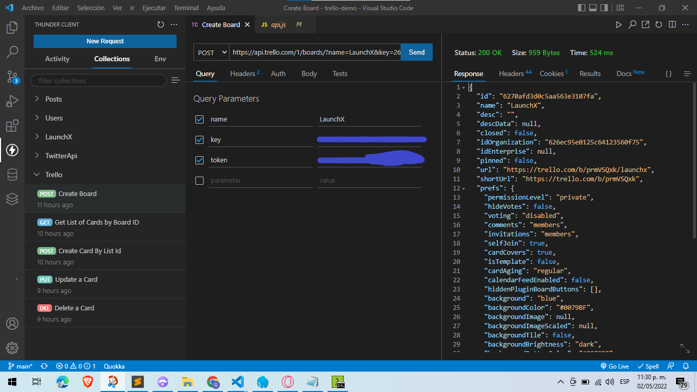
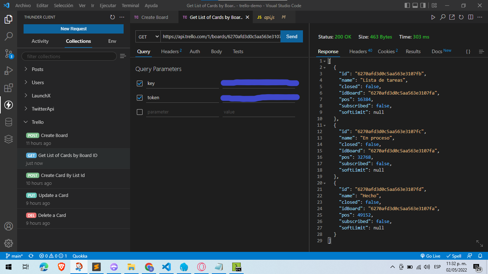
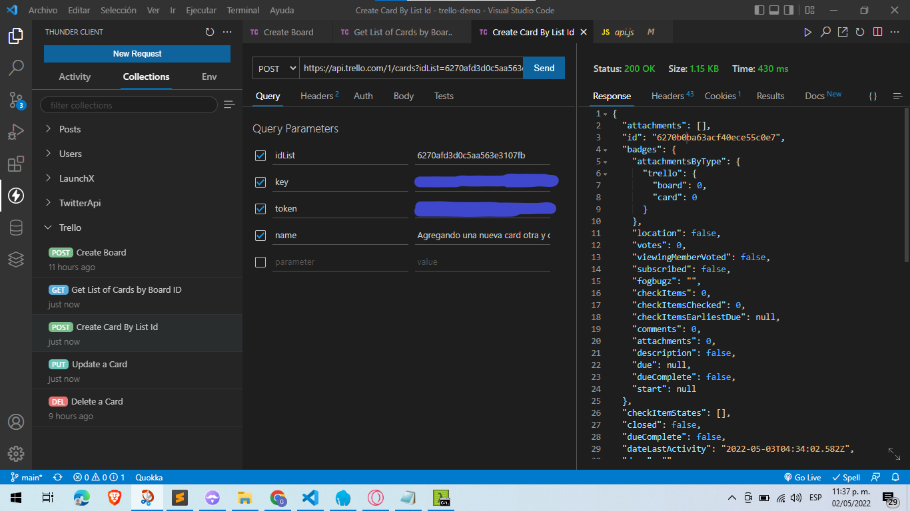
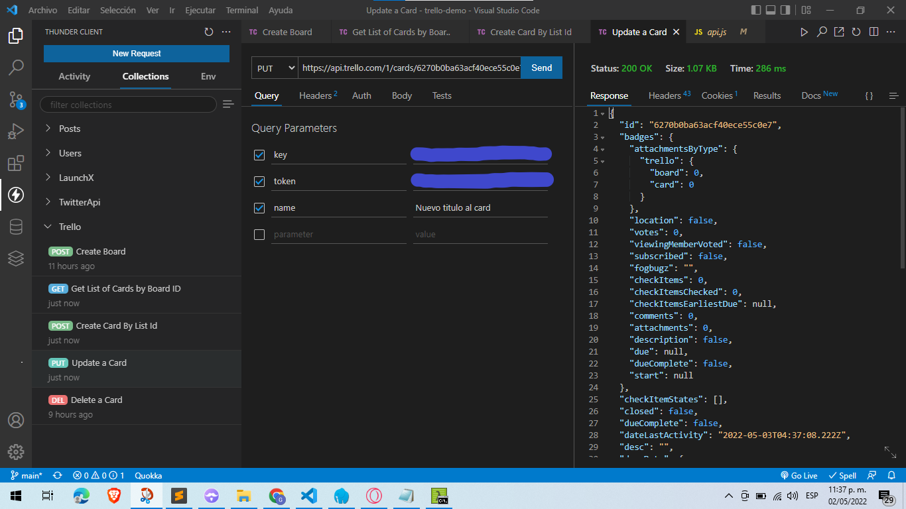
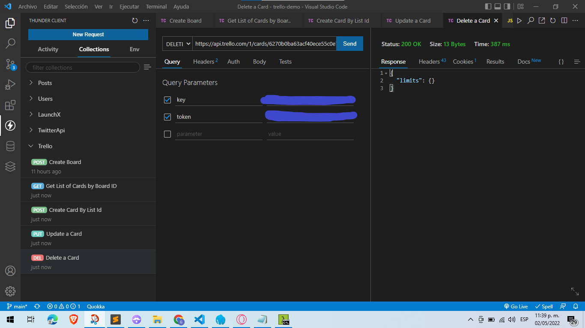

# Documentación de Trello Demo

Se utilizo el paquete **Express** para poder consumir la API de **Trello** y con el paquete de pruebas de cliente HTTP **ThunderClient** cuando este activado el servidor. Después de activarlo, poner el la dirección dependiendo de la situación, siempre se debe de incluir el KEY y el TOKEN en la dirección. Por razones de seguridad se oculto esos dos parámetros en las imágenes.

La razón principal que no se implemento Jest es debido a que el id de cara "board", "card" y "list" conforme se crean, se genera un id diferente y por eso no seria posible su implementación a pruebas.

## Create Board

## Get List of Cards by Board

## Create Card by List

## Update a Card

## Delete a Card

